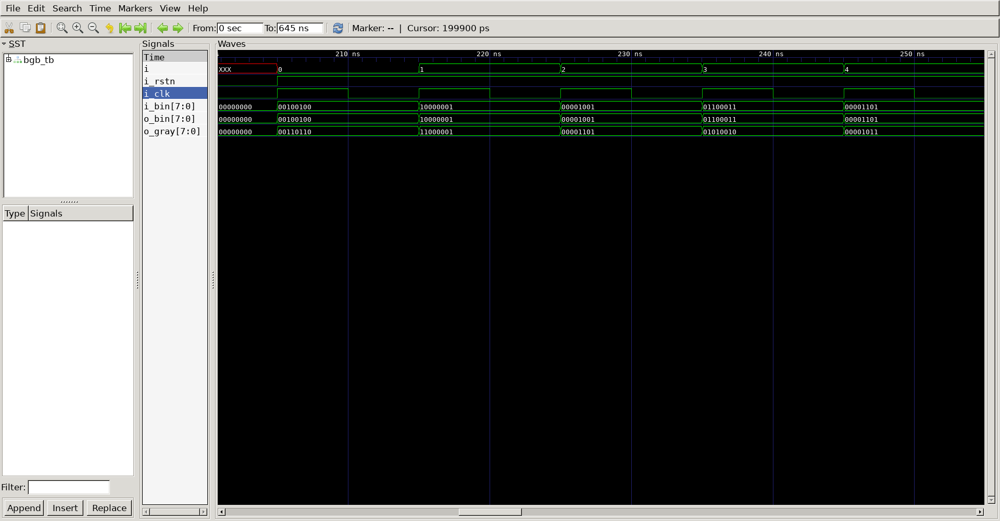

# Gray Code Converter   
## Operation Principle   
- Consecutive numbers differ in only one bit position.   
- Bin -> Gray   
	- G[N-1]	= B[N-1]
	- G[i]		= B[i+1] ^ B[i]   
	   
## Verilog Code   
### DUT   
	```verilog   

module gray_to_bin 
#(
	parameter	NBIT	= 8												//input data size
)(
	output reg	[NBIT-1 : 0]	o_bin,
	input		[NBIT-1 : 0]	i_gray,
	input						i_clk,
	input						i_rstn
);

	integer i;

	always @(*) begin
		if(!i_rstn) begin
			o_bin <= 0;													//RESET
		end else begin
		o_bin[NBIT-1] <= i_gray[NBIT-1];								//MSB
			for(i=2;i<NBIT+1;i++) begin
				o_bin[NBIT-i] = o_bin[NBIT-i+1] ^ i_gray[NBIT-i];
			end
		end
	end

endmodule
```   
```verilog
module bin_to_gray
#(
	parameter	NBIT	= 8								//input data size
)(
	output reg	[NBIT-1 : 0]	o_gray,
	input		[NBIT-1 : 0]	i_bin,
	input						i_clk,
	input						i_rstn
);

	always @(*) begin
		if(!i_rstn) begin
			o_gray <= 0;								//RESET
		end else begin
			o_gray <= (i_bin >> 1) ^ i_bin;
		end
	end

endmodule
```
### Testbench
```verilog
//-------------------------------
//Define & Include
//-------------------------------
`define	CLKFREQ		100
`define	SIMCYCLE	30
`define NBIT		8										//NBIT Gray Code Converter
`include "bin_to_gray.v"
`include "gray_to_bin.v"

module bgb_tb;

//-------------------------------
//Signal Declarations: wire
//-------------------------------
	wire	[`NBIT-1 : 0]	o_gray;
	wire	[`NBIT-1 : 0]	o_bin;
//-------------------------------
//Signal Declarations: reg 
//-------------------------------
	reg		[`NBIT-1 : 0]	i_bin;
	reg						i_clk;
	reg						i_rstn;

//-------------------------------
//CLK Generate
//-------------------------------
always #(500/`CLKFREQ) i_clk = ~i_clk;

//-------------------------------
//Module Instance
//-------------------------------
bin_to_gray u_bin_to_gray
(
	.o_gray 		(	o_gray		),
	.i_bin  		(	i_bin 		),
	.i_clk  		(	i_clk 		),
	.i_rstn 		(	i_rstn		)
);

gray_to_bin u_gray_to_bin
(
	.o_bin 			(	o_bin 		),
	.i_gray			(	o_gray		), 
	.i_clk 			(	i_clk 		),
	.i_rstn			(	i_rstn		)
);

//-------------------------------
//Tasks
//-------------------------------
task init;
	begin
        i_bin 	= 0;
        i_clk 	= 0;
        i_rstn	= 1;
			
		@(posedge i_clk);
		i_rstn	= 0;

		repeat(20) begin
			@(posedge i_clk);
		end
		
        i_rstn	= 1;

	end
endtask

//-------------------------------
//Test Start
//-------------------------------
integer i;
	initial begin
		init();									//input reset to 0
		for(i=0;i<`SIMCYCLE;i++) begin			//put random data
			i_bin = $urandom;
			@(posedge i_clk);
		end
		i_bin = 8'b0000_1010;					// => gray == 0000_1111
		@(posedge i_clk);
		i_bin = 8'b0000_0110;					// => gray == 0000_0101
		@(posedge i_clk);
		i_bin = 8'b0000_0111;					// => gray == 0000_0100
		@(posedge i_clk);
		i_bin = 8'b0000_0101;					// => gray == 0000_0111
		@(posedge i_clk);
		#(10000/`CLKFREQ);
		$finish;								//Test end
	end

//-------------------------------
//Dump VCD
//-------------------------------
reg [8*32-1:0]	vcd_file;
	initial begin
		if ($value$plusargs("vcd_file=%s", vcd_file)) begin
			$dumpfile(vcd_file);
			$dumpvars;
		end else begin
			$dumpfile("bgb_tb.vcd");
			$dumpvars;
		end
	end
endmodule
```
   
##	Simulation Result

