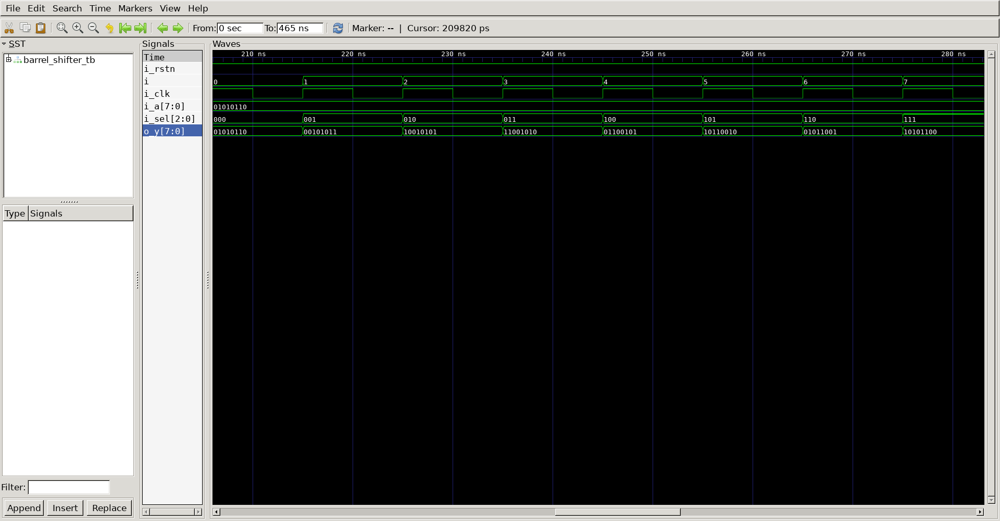

# Barrel Shifter   
## Operation Principle   
- Rotate data
k: rotate amount
data = 1010 , k = 1
result = 0101
## Verilog Code   
### DUT   

```verilog   
module barrel_shifter
#(
	parameter NBIT		= 8
)(
	output		[NBIT-1 : 0]	o_y,
	input		[NBIT-1 : 0]	i_a,
	input		[2:0]			i_sel,
	input						i_clk,
	input						i_rstn
);

	wire		[NBIT-1 : 0]	r4;
	wire		[NBIT-1 : 0]	r2;

//-------------------------------
//Rotate 4bit
//-------------------------------
mux u_mux_r4_0
(
	.o_data   	(	r4[0]	),
	.i_data_a 	(	i_a[0]	),
	.i_data_b 	(	i_a[4]	),
	.i_sel    	(	i_sel[2]),
	.i_clk    	(	i_clk	),
	.i_rstn   	(	i_rstn	)
);

mux u_mux_r4_1
(
	.o_data   	(	r4[1]	),
	.i_data_a 	(	i_a[1]	),
	.i_data_b 	(	i_a[5]	),
	.i_sel    	(	i_sel[2]),
	.i_clk    	(	i_clk	),
	.i_rstn   	(	i_rstn	)
);

mux u_mux_r4_2
(
	.o_data   	(	r4[2]	),
	.i_data_a 	(	i_a[2]	),
	.i_data_b 	(	i_a[6]	),
	.i_sel    	(	i_sel[2]),
	.i_clk    	(	i_clk	),
	.i_rstn   	(	i_rstn	)
);

mux u_mux_r4_3
(
	.o_data   	(	r4[3]	),
	.i_data_a 	(	i_a[3]	),
	.i_data_b 	(	i_a[7]	),
	.i_sel    	(	i_sel[2]),
	.i_clk    	(	i_clk	),
	.i_rstn   	(	i_rstn	)
);

mux u_mux_r4_4
(
	.o_data   	(	r4[4]	),
	.i_data_a 	(	i_a[4]	),
	.i_data_b 	(	i_a[0]	),
	.i_sel    	(	i_sel[2]),
	.i_clk    	(	i_clk	),
	.i_rstn   	(	i_rstn	)
);

mux u_mux_r4_5
(
	.o_data   	(	r4[5]	),
	.i_data_a 	(	i_a[5]	),
	.i_data_b 	(	i_a[1]	),
	.i_sel    	(	i_sel[2]),
	.i_clk    	(	i_clk	),
	.i_rstn   	(	i_rstn	)
);

mux u_mux_r4_6
(
	.o_data   	(	r4[6]	),
	.i_data_a 	(	i_a[6]	),
	.i_data_b 	(	i_a[2]	),
	.i_sel    	(	i_sel[2]),
	.i_clk    	(	i_clk	),
	.i_rstn   	(	i_rstn	)
);

mux u_mux_r4_7
(
	.o_data   	(	r4[7]	),
	.i_data_a 	(	i_a[7]	),
	.i_data_b 	(	i_a[3]	),
	.i_sel    	(	i_sel[2]),
	.i_clk    	(	i_clk	),
	.i_rstn   	(	i_rstn	)
);

//-------------------------------
//Rotate 2bit
//-------------------------------
mux u_mux_r2_0
(
	.o_data   	(	r2[0]	),
	.i_data_a 	(	r4[0]	),
	.i_data_b 	(	r4[2]	),
	.i_sel    	(	i_sel[1]),
	.i_clk    	(	i_clk	),
	.i_rstn   	(	i_rstn	)
);

mux u_mux_r2_1
(
	.o_data   	(	r2[1]	),
	.i_data_a 	(	r4[1]	),
	.i_data_b 	(	r4[3]	),
	.i_sel    	(	i_sel[1]),
	.i_clk    	(	i_clk	),
	.i_rstn   	(	i_rstn	)
);

mux u_mux_r2_2
(
	.o_data   	(	r2[2]	),
	.i_data_a 	(	r4[2]	),
	.i_data_b 	(	r4[4]	),
	.i_sel    	(	i_sel[1]),
	.i_clk    	(	i_clk	),
	.i_rstn   	(	i_rstn	)
);

mux u_mux_r2_3
(
	.o_data   	(	r2[3]	),
	.i_data_a 	(	r4[3]	),
	.i_data_b 	(	r4[5]	),
	.i_sel    	(	i_sel[1]),
	.i_clk    	(	i_clk	),
	.i_rstn   	(	i_rstn	)
);

mux u_mux_r2_4
(
	.o_data   	(	r2[4]	),
	.i_data_a 	(	r4[4]	),
	.i_data_b 	(	r4[6]	),
	.i_sel    	(	i_sel[1]),
	.i_clk    	(	i_clk	),
	.i_rstn   	(	i_rstn	)
);

mux u_mux_r2_5
(
	.o_data   	(	r2[5]	),
	.i_data_a 	(	r4[5]	),
	.i_data_b 	(	r4[7]	),
	.i_sel    	(	i_sel[1]),
	.i_clk    	(	i_clk	),
	.i_rstn   	(	i_rstn	)
);

mux u_mux_r2_6
(
	.o_data   	(	r2[6]	),
	.i_data_a 	(	r4[6]	),
	.i_data_b 	(	r4[0]	),
	.i_sel    	(	i_sel[1]),
	.i_clk    	(	i_clk	),
	.i_rstn   	(	i_rstn	)
);

mux u_mux_r2_7
(
	.o_data   	(	r2[7]	),
	.i_data_a 	(	r4[7]	),
	.i_data_b 	(	r4[1]	),
	.i_sel    	(	i_sel[1]),
	.i_clk    	(	i_clk	),
	.i_rstn   	(	i_rstn	)
);

//-------------------------------
//Rotate 1bit
//-------------------------------
mux u_mux_r1_0
(
	.o_data   	(	o_y[0]	),
	.i_data_a 	(	r2[0]	),
	.i_data_b 	(	r2[1]	),
	.i_sel    	(	i_sel[0]),
	.i_clk    	(	i_clk	),
	.i_rstn   	(	i_rstn	)
);

mux u_mux_r1_1
(
	.o_data   	(	o_y[1]	),
	.i_data_a 	(	r2[1]	),
	.i_data_b 	(	r2[2]	),
	.i_sel    	(	i_sel[0]),
	.i_clk    	(	i_clk	),
	.i_rstn   	(	i_rstn	)
);

mux u_mux_r1_2
(
	.o_data   	(	o_y[2]	),
	.i_data_a 	(	r2[2]	),
	.i_data_b 	(	r2[3]	),
	.i_sel    	(	i_sel[0]),
	.i_clk    	(	i_clk	),
	.i_rstn   	(	i_rstn	)
);

mux u_mux_r1_3
(
	.o_data   	(	o_y[3]	),
	.i_data_a 	(	r2[3]	),
	.i_data_b 	(	r2[4]	),
	.i_sel    	(	i_sel[0]),
	.i_clk    	(	i_clk	),
	.i_rstn   	(	i_rstn	)
);

mux u_mux_r1_4
(
	.o_data   	(	o_y[4]	),
	.i_data_a 	(	r2[4]	),
	.i_data_b 	(	r2[5]	),
	.i_sel    	(	i_sel[0]),
	.i_clk    	(	i_clk	),
	.i_rstn   	(	i_rstn	)
);

mux u_mux_r1_5
(
	.o_data   	(	o_y[5]	),
	.i_data_a 	(	r2[5]	),
	.i_data_b 	(	r2[6]	),
	.i_sel    	(	i_sel[0]),
	.i_clk    	(	i_clk	),
	.i_rstn   	(	i_rstn	)
);

mux u_mux_r1_6
(
	.o_data   	(	o_y[6]	),
	.i_data_a 	(	r2[6]	),
	.i_data_b 	(	r2[7]	),
	.i_sel    	(	i_sel[0]),
	.i_clk    	(	i_clk	),
	.i_rstn   	(	i_rstn	)
);

mux u_mux_r1_7
(
	.o_data   	(	o_y[7]	),
	.i_data_a 	(	r2[7]	),
	.i_data_b 	(	r2[0]	),
	.i_sel    	(	i_sel[0]),
	.i_clk    	(	i_clk	),
	.i_rstn   	(	i_rstn	)
);


endmodule

module mux
(
	output	reg 		o_data,
	input				i_data_a,
	input				i_data_b,
	input				i_sel,
	input				i_clk,
	input				i_rstn
);

	always @(*) begin
		if(!i_rstn) begin
			o_data	= 0;
		end else begin
			case (i_sel)
				0 : o_data = i_data_a;
				1 : o_data = i_data_b;
			endcase
		end
	end
	
endmodule
```   
### Testbench
```verilog
//-------------------------------
//Define & Include
//-------------------------------
`define NBIT		8
`define	SIMCYCLE	8
`define	CLKFREQ		100
`include "barrel_shifter.v"

module barrel_shifter_tb;

//-------------------------------
//Signal Declarations: wire
//-------------------------------

	wire	[`NBIT-1 : 0]	o_y;
//-------------------------------
//Signal Declarations: reg 
//-------------------------------

	reg		[`NBIT-1 : 0]	i_a;
	reg		[2:0]			i_sel;
	reg						i_clk;
	reg						i_rstn;

//-------------------------------
//CLK Generate
//-------------------------------
always #(500/`CLKFREQ) i_clk = ~i_clk;

//-------------------------------
//Module Instance
//-------------------------------

barrel_shifter u_barrel_shifter
(
	.o_y    		(	o_y   	),
	.i_a    		(	i_a   	),
	.i_sel  		(	i_sel 	),
	.i_clk  		(	i_clk 	),
	.i_rstn 		(	i_rstn	)
);

//-------------------------------
//Tasks
//-------------------------------
task init;
	begin
		i_a	= 0;
		i_sel = 0;
        i_clk 		= 0;
        i_rstn		= 1;
			
		@(posedge i_clk);
		i_rstn	= 0;

		repeat(20) begin
			@(posedge i_clk);
		end
		
        i_rstn	= 1;

	end
endtask

//-------------------------------
//Test Start
//-------------------------------
integer i;
	initial begin
		init();
		for(i=0;i<`SIMCYCLE;i++) begin
			i_a = 8'h56;
			i_sel = i;
			@(posedge i_clk);
		end
		for(i=0;i<`SIMCYCLE;i++) begin
			i_a = 8'h56;
			i_sel = i;
			@(posedge i_clk);
		end
		#100;
		$finish;
	end
//-------------------------------
//Dump VCD
//-------------------------------
reg [8*32-1:0]	vcd_file;
	initial begin
		if ($value$plusargs("vcd_file=%s", vcd_file)) begin
			$dumpfile(vcd_file);
			$dumpvars;
		end else begin
			$dumpfile("barrel_shifter_tb.vcd");
			$dumpvars;
		end
	end
endmodule

```
##	Simulation Result   

