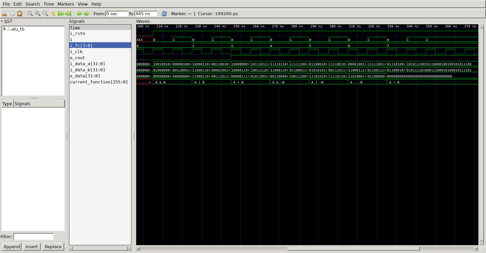

# ALU
## Operation Principle
-An Arithmetic Logic Unit (ALU) is a fundamental building block of a CPU that   
performs arithmetic and logical operations on binary data.   
it's like the math whiz ofthe computer, responsible for calculations and logical comparisons.

## Verilog Code 
### DUT
```verilog 
module alu
#(
	parameter	NBIT	= 32
)(
	output	reg	[NBIT-1 : 0]	o_data,
	output	reg					o_cout,
	input		[NBIT-1 : 0]	i_data_a,
	input		[NBIT-1 : 0]	i_data_b,
	input		[3:0]			i_fc,
	input						i_clk,
	input						i_rstn
);

	always @(*) begin
		if(!i_rstn) begin
			o_data	<= 0;
			o_cout	<= 0;
		end else begin
			case(i_fc)
				3'b000 : o_data <= i_data_a & i_data_b;
				3'b001 : o_data <= i_data_a | i_data_b;
				3'b010 : {o_cout, o_data} <= i_data_a + i_data_b;
				3'b011 : o_data <= 0;
				3'b100 : o_data <= i_data_a & ~i_data_b;
				3'b101 : o_data <= i_data_a | ~i_data_b;
				3'b110 : o_data <= i_data_a - ~i_data_b;
				3'b111 : o_data <= (i_data_a < i_data_b) ? 1 : 0;
				default : o_data <= 0;
			endcase
		end
	end
endmodule
```
### Testbench
```verilog 
//-------------------------------
//Define & Include
//-------------------------------
`define NBIT		32
`define SIMCYCLE	2
`define CLKFREQ		100
`include "alu.v"

module alu_tb;

//-------------------------------
//Signal Declarations: wire
//-------------------------------
	wire	[`NBIT-1 : 0]	o_data;
	wire					o_cout;

//-------------------------------
//Signal Declarations: reg 
//-------------------------------
	reg		[`NBIT-1 : 0]	i_data_a;
	reg		[`NBIT-1 : 0]	i_data_b;
	reg		[3:0]			i_fc;
	reg						i_clk;
	reg						i_rstn;
	reg		[8*32-1 : 0]	current_function;

//-------------------------------
//CLK Generate
//-------------------------------
always #(500/`CLKFREQ) i_clk = ~i_clk;

//-------------------------------
//Module Instance
//-------------------------------
alu u_alu
(
	.o_data   		(	o_data  	),
	.o_cout    		(	o_cout   	),
	.i_data_a 		(	i_data_a	),
	.i_data_b 		(	i_data_b	),
	.i_fc     		(	i_fc    	),
	.i_clk    		(	i_clk   	),
	.i_rstn   		(	i_rstn  	)
);

//-------------------------------
//Tasks
//-------------------------------
task init;
	begin
		i_data_a	= 0;
		i_data_b	= 0;		
		i_fc		= 0;   		
        i_clk 		= 0;
        i_rstn		= 1;
			
		@(posedge i_clk);
		i_rstn	= 0;

		repeat(20) begin
			@(posedge i_clk);
		end
		
        i_rstn	= 1;

	end
endtask

//-------------------------------
//Test Start
//-------------------------------
integer i;
	initial begin
		init();
		for(i=0;i<`SIMCYCLE;i++) begin
			i_fc = 3'b000;
			i_data_a = $urandom;
			i_data_b = $urandom;
			current_function = " A & B ";
			@(posedge i_clk);
		end
		for(i=0;i<`SIMCYCLE;i++) begin
			i_fc = 3'b001;
			i_data_a = $urandom;
			i_data_b = $urandom;
			current_function = " A | B ";
			@(posedge i_clk);
		end
		for(i=0;i<`SIMCYCLE;i++) begin
			i_fc = 3'b010;
			i_data_a = $urandom;
			i_data_b = $urandom;
			current_function = " A + B ";
			@(posedge i_clk);
		end
		for(i=0;i<`SIMCYCLE;i++) begin
			i_fc = 3'b100;
			i_data_a = $urandom;
			i_data_b = $urandom;
			current_function = " A & ~B ";
			@(posedge i_clk);
		end
		for(i=0;i<`SIMCYCLE;i++) begin
			i_fc = 3'b101;
			i_data_a = $urandom;
			i_data_b = $urandom;
			current_function = " A | ~B ";
			@(posedge i_clk);
		end
		for(i=0;i<`SIMCYCLE;i++) begin
			i_fc = 3'b110;
			i_data_a = $urandom;
			i_data_b = $urandom;
			current_function = " A - ~B ";
			@(posedge i_clk);
		end
		for(i=0;i<`SIMCYCLE;i++) begin
			i_fc = 3'b111;
			i_data_a = $urandom;
			i_data_b = $urandom;
			current_function = " A < B ";
			@(posedge i_clk);
		end
		#100;
		$finish;
	end

//-------------------------------
//Dump VCD
//-------------------------------
reg [8*32-1:0]	vcd_file;
	initial begin
		if ($value$plusargs("vcd_file=%s", vcd_file)) begin
			$dumpfile(vcd_file);
			$dumpvars;
		end else begin
			$dumpfile("alu_tb.vcd");
			$dumpvars;
		end
	end
endmodule
```
##	Simulation Result
;

