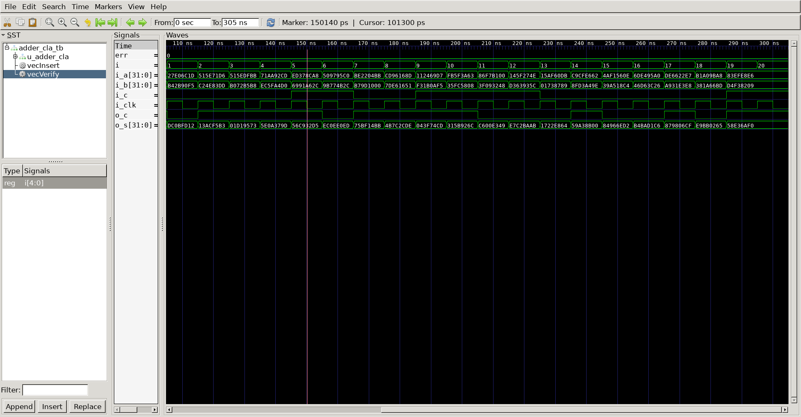

# Adder Cla
## Operation Principle
- 4bit Adder * n => 32bit Carry Lookahead Adder   
- p = a ^ b   
- g = a & b   
- s = a ^ b ^ Cin   
- Cout = g | (p & Cin)   

## Verilog Code
### DUT
```verilog

module fa_4bit
(
	output		 [3:0]	o_s,
	output				o_c,
	input		[3:0]	i_a,
	input		[3:0]	i_b,
	input				i_c
);

wire [3:0]	p;
wire [3:0]	g;
wire [3:0]	c;
wire [2:0]	ff_c;

assign p[0] = i_a[0] ^ i_b[0];
assign p[1] = i_a[1] ^ i_b[1];
assign p[2] = i_a[2] ^ i_b[2];
assign p[3] = i_a[3] ^ i_b[3];

assign g[0] = i_a[0] & i_b[0];
assign g[1] = i_a[1] & i_b[1];
assign g[2] = i_a[2] & i_b[2];
assign g[3] = i_a[3] & i_b[3];

assign ff_c[0] = g[0] | (p[0] & i_c);
assign ff_c[1] = g[1] | (p[1] & ff_c[0]);
assign ff_c[2] = g[2] | (p[2] & ff_c[1]);
assign o_c = g[3] | (p[3] & ff_c[2]);

assign o_s[0] = i_a[0] ^ i_b[0] ^ i_c;
assign o_s[1] = i_a[1] ^ i_b[1] ^ ff_c[0];
assign o_s[2] = i_a[2] ^ i_b[2] ^ ff_c[1];
assign o_s[3] = i_a[3] ^ i_b[3] ^ ff_c[2];

endmodule

module adder_cla
#(
	parameter NBIT	=	32
)(
	output		[NBIT-1:0]	o_s,
	output					o_c,
	input		[NBIT-1:0]	i_a,
	input		[NBIT-1:0]	i_b,
	input					i_c
);

wire o_c_0;
wire o_c_1;
wire o_c_2;
wire o_c_3;
wire o_c_4;
wire o_c_5;
wire o_c_6;

fa_4bit u_fa_4bit_0
(
	.o_s	(	o_s[3:0]),
	.o_c	(	o_c_0	),
	.i_a	(	i_a[3:0]),
	.i_b	(	i_b[3:0]),
	.i_c	(	i_c		)
);

fa_4bit u_fa_4bit_1
(
	.o_s	(	o_s[7:4]),
	.o_c	(	o_c_1	),
	.i_a	(	i_a[7:4]	),
	.i_b	(	i_b[7:4]	),
	.i_c	(	o_c_0		)
);

fa_4bit u_fa_4bit_2
(
	.o_s	(	o_s[11:8]),
	.o_c	(	o_c_2	),
	.i_a	(	i_a[11:8]		),
	.i_b	(	i_b[11:8]		),
	.i_c	(	o_c_1		)
);

fa_4bit u_fa_4bit_3 (
	.o_s	(	o_s[15:12]),
	.o_c	(	o_c_3	),
	.i_a	(	i_a[15:12]),
	.i_b	(	i_b[15:12]),
	.i_c	(	o_c_2	)
);

fa_4bit u_fa_4bit_4 (
	.o_s	(	o_s[19:16]),
	.o_c	(	o_c_4	),
	.i_a	(	i_a[19:16]),
	.i_b	(	i_b[19:16]),
	.i_c	(	o_c_3	)
);

fa_4bit u_fa_4bit_5 (
	.o_s	(	o_s[23:20]),
	.o_c	(	o_c_5	),
	.i_a	(	i_a[23:20]),
	.i_b	(	i_b[23:20]),
	.i_c	(	o_c_4	)
);

fa_4bit u_fa_4bit_6 (
	.o_s	(	o_s[27:24]),
	.o_c	(	o_c_6	),
	.i_a	(	i_a[27:24]),
	.i_b	(	i_b[27:24]),
	.i_c	(	o_c_5	)
);

fa_4bit u_fa_4bit_7 (
	.o_s	(	o_s[31:28]),
	.o_c	(	o_c	),
	.i_a	(	i_a[31:28]),
	.i_b	(	i_b[31:28]),
	.i_c	(	o_c_6	)
);

endmodule
```
###	Testbench
```verilog
//-------------------------------
//Define & Include
//-------------------------------
`define NBIT		32
`define	SIMCYCLE	20
`define	CLKFREQ		100
`define NVEC		20
`include "adder_cla.v"

module adder_cla_tb;

//-------------------------------
//Signal Declarations: wire
//-------------------------------

	wire		[`NBIT-1:0]	o_s ;
	wire					o_c ;
//-------------------------------
//Signal Declarations: reg 
//-------------------------------
	reg		[`NBIT-1:0]	i_a;
	reg		[`NBIT-1:0]	i_b;
	reg					i_c;
	reg					i_clk;

//-------------------------------
//CLK Generate
//-------------------------------
always #(500/`CLKFREQ) i_clk = ~i_clk;

//-------------------------------
//Module Instance
//-------------------------------

adder_cla u_adder_cla
(
	.o_s	(	o_s	),
	.o_c	(	o_c	),
	.i_a	(	i_a	),
	.i_b	(	i_b	),
	.i_c	(	i_c	)
);

// --------------------------------------------------
//	Test Vector Configuration
// --------------------------------------------------
	reg		[`NBIT-1:0]	vo_s[0:`NVEC-1];
	reg						vo_c[0:`NVEC-1];
	reg		[`NBIT-1:0]	vi_a[0:`NVEC-1];
	reg		[`NBIT-1:0]	vi_b[0:`NVEC-1];
	reg						vi_c[0:`NVEC-1];

	initial begin
		$readmemb("./vec/o_s.vec",			vo_s);
		$readmemb("./vec/o_c.vec",			vo_c);
		$readmemb("./vec/i_a.vec",			vi_a);
		$readmemb("./vec/i_b.vec",			vi_b);
		$readmemb("./vec/i_c.vec",			vi_c);
	end
//-------------------------------
//Tasks
//-------------------------------
integer err	= 0;
task vecInsert;
		input	[$clog2(`NVEC)-1:0]	i;
		begin
			i_a				= vi_a[i];
			i_b				= vi_b[i];
			i_c				= vi_c[i];
		end
	endtask

	task vecVerify;
		input	[$clog2(`NVEC)-1:0]	i;
		begin
			#(0.1*1000/`CLKFREQ);
			if (o_s				!= vo_s[i]) begin $display("[Idx: %3d] Mismatched o_s", i); end
			if (o_c				!= vo_c[i]) begin $display("[Idx: %3d] Mismatched o_c", i); end
			if ((o_s != vo_s[i]) || (o_c != vo_c[i])) begin err++; end
			#(0.9*1000/`CLKFREQ);
		end
	endtask

task init;
	begin
		i_a	= 0;
		i_b	= 0;
		i_c = 0;
        i_clk 		= 0;

		repeat(10) 	
		@(posedge i_clk);
	end
endtask

//-------------------------------
//Test Start
//-------------------------------
integer		i;
	initial begin
		init();
		for (i=0; i<`SIMCYCLE; i++) begin
			vecInsert(i);
			vecVerify(i);
		end
		#(1000/`CLKFREQ);
		$finish;
	end

//-------------------------------
//Dump VCD
//-------------------------------
reg [8*32-1:0]	vcd_file;
	initial begin
		if ($value$plusargs("vcd_file=%s", vcd_file)) begin
			$dumpfile(vcd_file);
			$dumpvars;
		end else begin
			$dumpfile("adder_cla_tb.vcd");
			$dumpvars;
		end
	end
endmodule
```

##	Simulation Result
;
