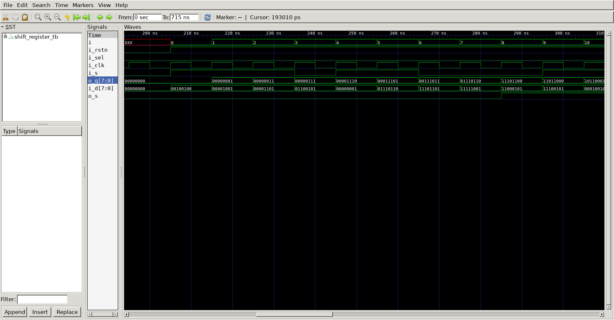
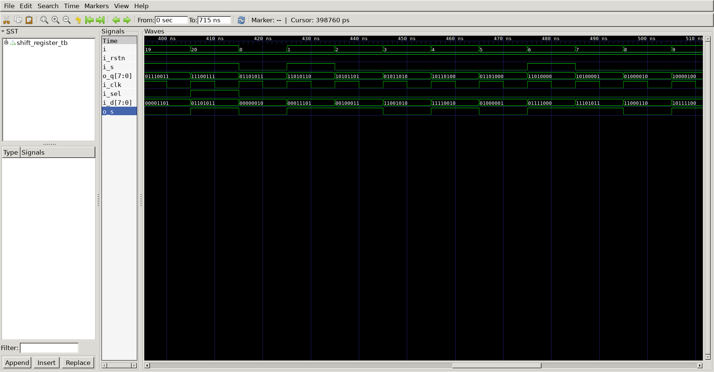

# Shift Register   
## Operation Principle   
- when Load = 1, acts as a normal N-bit register   
- when Load = 0, acts as a shift register   
: Serial-to-parallel converter: Sin to Q   
@ 1 Cycle : Load = 1, @ other cycles : Load = 0   
: Parallel-to-serial converter: D to Sout   
   
## Verilog Code   
### DUT   
```verilog   
module shift_register
#(
	parameter NBIT	=	8
)(
	output						o_s,
	output		[NBIT-1 : 0]	o_q,
	input		[NBIT-1 : 0]	i_d,
	input						i_s,
	input						i_sel,
	input						i_clk,
	input						i_rstn
);

mux u_mux_0
(
	.o_data   	(	o_q[0]	),
	.i_data_a 	(	i_s		),
	.i_data_b 	(	i_d[0]	),
	.i_sel    	(	i_sel	),
	.i_clk    	(	i_clk	),
	.i_rstn   	(	i_rstn	)
);

mux u_mux_1
(
	.o_data   	(	o_q[1]	),
	.i_data_a 	(	o_q[0]	),
	.i_data_b 	(	i_d[1]	),
	.i_sel    	(	i_sel	),
	.i_clk    	(	i_clk	),
	.i_rstn   	(	i_rstn	)
);

mux u_mux_2
(
	.o_data   	(	o_q[2]	),
	.i_data_a 	(	o_q[1]	),
	.i_data_b 	(	i_d[2]	),
	.i_sel    	(	i_sel	),
	.i_clk    	(	i_clk	),
	.i_rstn   	(	i_rstn	)
);

mux u_mux_3
(
	.o_data   	(	o_q[3]	),
	.i_data_a 	(	o_q[2]	),
	.i_data_b 	(	i_d[3]	),
	.i_sel    	(	i_sel	),
	.i_clk    	(	i_clk	),
	.i_rstn   	(	i_rstn	)
);

mux u_mux_4
(
	.o_data   	(	o_q[4]	),
	.i_data_a 	(	o_q[3]	),
	.i_data_b 	(	i_d[4]	),
	.i_sel    	(	i_sel	),
	.i_clk    	(	i_clk	),
	.i_rstn   	(	i_rstn	)
);

mux u_mux_5
(
	.o_data   	(	o_q[5]	),
	.i_data_a 	(	o_q[4]	),
	.i_data_b 	(	i_d[5]	),
	.i_sel    	(	i_sel	),
	.i_clk    	(	i_clk	),
	.i_rstn   	(	i_rstn	)
);

mux u_mux_6
(
	.o_data   	(	o_q[6]	),
	.i_data_a 	(	o_q[5]	),
	.i_data_b 	(	i_d[6]	),
	.i_sel    	(	i_sel	),
	.i_clk    	(	i_clk	),
	.i_rstn   	(	i_rstn	)
);

mux u_mux_7
(
	.o_data   	(	o_q[7]	),
	.i_data_a 	(	o_q[6]	),
	.i_data_b 	(	i_d[7]	),
	.i_sel    	(	i_sel	),
	.i_clk    	(	i_clk	),
	.i_rstn   	(	i_rstn	)
);

assign o_s = o_q[7];

endmodule

module mux
(
	output	reg 		o_data,
	input				i_data_a,
	input				i_data_b,
	input				i_sel,
	input				i_clk,
	input				i_rstn
);

wire o_ff;

	assign o_ff = (i_sel) ? i_data_b : i_data_a;
	always @(posedge i_clk) begin
		if(!i_rstn) begin
			o_data	= 0;
		end else begin
			o_data <= o_ff;
		end
	end
	
endmodule
```
   
### Testbench   
```verilog   

//-------------------------------
//Define & Include
//-------------------------------
`define NBIT		8
`define	SIMCYCLE	20
`define	CLKFREQ		100
`include "shift_register.v"

module shift_register_tb;

//-------------------------------
//Signal Declarations: wire
//-------------------------------

	wire						o_s;
	wire		[`NBIT-1 : 0]	o_q;
//-------------------------------
//Signal Declarations: reg 
//-------------------------------

	reg		[`NBIT-1 : 0]	i_d;
	reg						i_s;
	reg						i_sel;
	reg						i_clk;
	reg						i_rstn;
//-------------------------------
//CLK Generate
//-------------------------------
always #(500/`CLKFREQ) i_clk = ~i_clk;

//-------------------------------
//Module Instance
//-------------------------------

shift_register u_shift_register
(
	.o_s   (	o_s   	) ,
	.o_q   (	o_q   	) ,
	.i_d   (	i_d   	) ,
	.i_s   (	i_s   	) ,
	.i_sel (	i_sel 	) ,
	.i_clk (	i_clk 	) ,
	.i_rstn(	i_rstn	)
);

//-------------------------------
//Tasks
//-------------------------------
task init;
	begin
		i_d	= 0;
		i_s	= 0;
		i_sel = 0;
        i_clk 		= 0;
        i_rstn		= 1;
			
		@(posedge i_clk);
		i_rstn	= 0;

		repeat(20) begin
			@(posedge i_clk);
		end
		
        i_rstn	= 1;

	end
endtask

//-------------------------------
//Test Start
//-------------------------------
integer i;
integer j;
	initial begin
		init();
		for(i=0;i<`SIMCYCLE;i++) begin
			i_d = $urandom;
			i_s = $urandom;
			i_sel = 0;
			@(posedge i_clk);
		end
			i_d = $urandom;
			i_s = $urandom;
			i_sel = 1;
			@(posedge i_clk);
		
		for(i=0;i<`SIMCYCLE;i++) begin
			i_d = $urandom;
			i_s = $urandom;
			i_sel = 0;
			@(posedge i_clk);
		end
		#100;
		$finish;
	end
//-------------------------------
//Dump VCD
//-------------------------------
reg [8*32-1:0]	vcd_file;
	initial begin
		if ($value$plusargs("vcd_file=%s", vcd_file)) begin
			$dumpfile(vcd_file);
			$dumpvars;
		end else begin
			$dumpfile("shift_register_tb.vcd");
			$dumpvars;
		end
	end
endmodule
```   

##	Simulation Result   
-serial_to_parallel

-parallel_to_serial   

