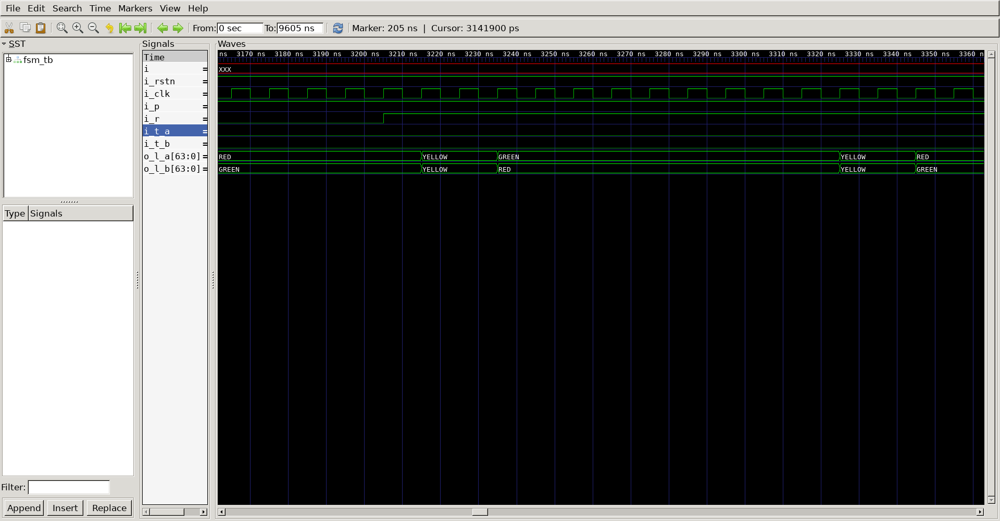
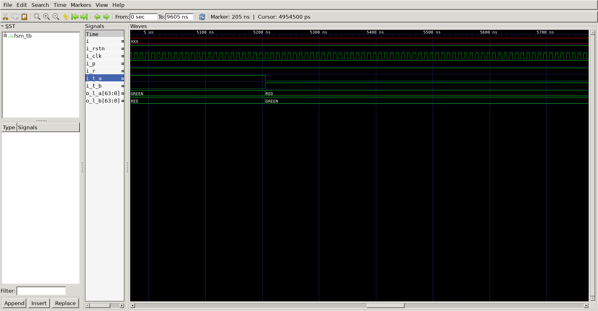

# Fsm Traffic Light Controller
## Operation Principle
- Modify Traffic Light Controller to have parade mode

## Verilog Code
### DUT
```verilog 

module fsm_traffic_light
(
	output	reg	[8*8-1 : 0]		o_l_a,
	output	reg	[8*8-1 : 0]		o_l_b,
	input						i_p,
	input						i_r,
	input						i_t_a,
	input						i_t_b,
	input						i_clk,
	input						i_rstn
);

wire mode;

reg		[3:0]	cnt;
reg		[2:0]	cState;
reg		[2:0]	nState;

localparam	S_0		=	3'b001;
localparam	S_1		=	3'b010;
localparam	S_2		=	3'b011;
localparam	S_3		=	3'b111;

assign	mode = (i_r) ? 0 :
			   (i_p) ? 1 : 0;

always @(posedge i_clk or negedge i_rstn) begin
	if(!i_rstn) begin
		cState	<= S_0;
		nState	<= S_0;
		cnt		<= 0;
	end else begin
		if(mode || i_t_b) begin
			cState	= S_2;
		end else begin
			if(i_t_a) begin
				cState	= S_0;
			end else begin
				cState	<= nState;
			end
		end
	end
end

always @(*) begin
	case (cState)
		S_0		: begin
				o_l_a	= "GREEN";
				o_l_b	= "RED";
				if(cnt == 9) begin
					nState = S_1;
				end else begin
					nState = S_0;
				end
		end
		S_1		: begin
				o_l_a	= "YELLOW";
				o_l_b	= "YELLOW";
				if(cnt == 2) begin
					nState = S_2;
				end else begin
					nState = S_1;
				end
		end
		S_2		: begin
				o_l_a	= "RED";
				o_l_b	= "GREEN";
				if(cnt == 9) begin
					nState = S_3;
				end else begin
					nState = S_2;
				end
		end
		S_3		: begin
				o_l_a	= "YELLOW";
				o_l_b	= "YELLOW";
				if(cnt == 2) begin
					nState = S_0;
				end else begin
					nState = S_3;
				end
		end
	endcase
end

always @(i_clk) begin
	if( cnt == 10)
		cnt = 0;
	else
	cnt = cnt + 1;
end	


endmodule
```

### Testbench
```verilog 
//-------------------------------
//Define & Include
//-------------------------------
`define	SIMCYCLE	8
`define	CLKFREQ		100
`include "fsm_traffic_light.v"

module fsm_tb;

//-------------------------------
//Signal Declarations: wire
//-------------------------------

	wire	[8*8-1 : 0]		o_l_a;
	wire	[8*8-1 : 0]		o_l_b;
	reg						i_p;
	reg						i_r;
	reg						i_t_a;
	reg						i_t_b;
	reg						i_clk;
	reg						i_rstn;

//-------------------------------
//CLK Generate
//-------------------------------
always #(500/`CLKFREQ) i_clk = ~i_clk;

//-------------------------------
//Module Instance
//-------------------------------

fsm_traffic_light u_fsm_traffic_light
(
	.o_l_a 		(	o_l_a 		),
	.o_l_b 		(	o_l_b 		),
	.i_p   		(	i_p   		),
	.i_r   		(	i_r   		),
	.i_t_a 		(	i_t_a 		),
	.i_t_b 		(	i_t_b 		),
	.i_clk 		(	i_clk 		),
	.i_rstn     (	i_rstn	 	)
);
//-------------------------------
//Tasks
//-------------------------------
task init;
	begin
		i_p	= 0;
		i_r	= 0;
		i_t_a= 0;
		i_t_b= 0;
        i_clk 		= 0;
        i_rstn		= 1;
			
		@(posedge i_clk);
		i_rstn	= 0;

		repeat(20) begin
			@(posedge i_clk);
		end
		
        i_rstn	= 1;

	end
endtask
//-------------------------------
//Test Start
//-------------------------------
integer i;
	initial begin
		init();
			repeat(100)
			@(posedge i_clk);
			i_p = 1;
			repeat(200)
			@(posedge i_clk);
			i_r = 1;
			repeat(100)
			@(posedge i_clk);
			i_t_a = 1;
			repeat(100)
			@(posedge i_clk);
			i_t_a = 0;
			i_t_b = 1;
			repeat(100)
			@(posedge i_clk);
			i_t_b = 0;
			repeat(100)
			@(posedge i_clk);
			for(i=0;i<`SIMCYCLE;i++) begin
				i_p		=	$urandom;
				i_r		=	$urandom;
				#(10000/`CLKFREQ);
			end			
			for(i=0;i<`SIMCYCLE;i++) begin
				i_t_a	=	$urandom;
				i_t_b	=	$urandom;
				#(10000/`CLKFREQ);
			end			
			for(i=0;i<`SIMCYCLE;i++) begin
				i_p		=	$urandom;
				i_r		=	$urandom;
				i_t_a	=	$urandom;
				i_t_b	=	$urandom;
				#(10000/`CLKFREQ);
			end			
			$finish;
		end

//-------------------------------
//Dump VCD
//-------------------------------
reg [8*32-1:0]	vcd_file;
	initial begin
		if ($value$plusargs("vcd_file=%s", vcd_file)) begin
			$dumpfile(vcd_file);
			$dumpvars;
		end else begin
			$dumpfile("fsm_tb.vcd");
			$dumpvars;
		end
	end
endmodule
```

##	Simulation Result
-normal Traffic
;
-parade
;
-stop_parade
;
-Ta_high
;
-Tb_high
;

