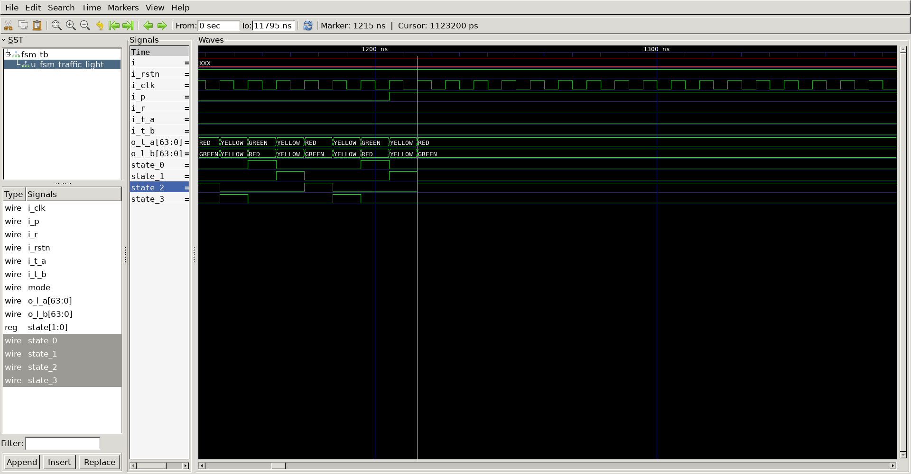
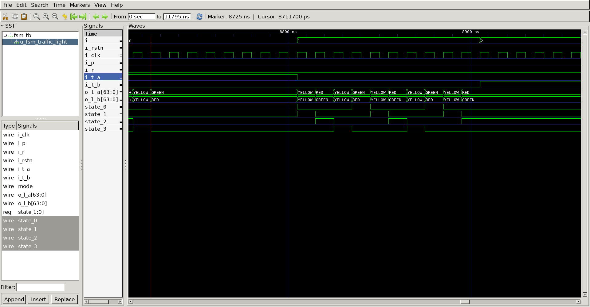

# Fsm Traffic Light Controller
## Operation Principle
- Modify Traffic Light Controller to have parade mode

## Verilog Code
### DUT
```verilog 
module fsm_traffic_light
(
	output		[8*8-1 : 0]		o_l_a,
	output		[8*8-1 : 0]		o_l_b,
	input						i_p,
	input						i_r,
	input						i_t_a,
	input						i_t_b,
	input						i_clk,
	input						i_rstn
);

wire		mode;
reg	[1:0]	state;
wire		state_0;
wire		state_1;
wire		state_2;
wire		state_3;

assign	mode	=	(i_r)	? 0 :
					(i_p)	? 1 : 0;
assign	state_0	=	(state == 0) ? 1 : 0;
assign	state_1	=	(state == 1) ? 1 : 0;
assign	state_2	=	(state == 2) ? 1 : 0;
assign	state_3	=	(state == 3) ? 1 : 0;

assign	o_l_a	=	(state_0)	?	"GREEN"		:
					(state_1)	?	"YELLOW"	:
					(state_2)	?	"RED"		:
					(state_3)	?	"YELLOW"	:	"GREEN";

assign	o_l_b	=	(state_0)	?	"RED"		:
					(state_1)	?	"YELLOW"	:
					(state_2)	?	"GREEN"		:
					(state_3)	?	"YELLOW"	:	"RED";

always @(posedge i_clk or negedge i_rstn) begin
	if(!i_rstn) begin
		state	= 0;
	end else begin
		if (mode) begin
			state	<= 2;
		end else begin
			if(state_0 & i_t_a) begin
				state	<=	0;
			end else begin
				if(state_2 & i_t_b) begin
					state	<=	2;
				end else begin
					state	<=	state + 1;
				end
			end
		end
	end
end

endmodule

```

### Testbench
```verilog 
//-------------------------------
//Define & Include
//-------------------------------
`define	SIMCYCLE	15
`define	CLKFREQ		100
`include "fsm_traffic_light_2.v"

module fsm_tb;

//-------------------------------
//Signal Declarations: wire
//-------------------------------

	wire	[8*8-1 : 0]		o_l_a;
	wire	[8*8-1 : 0]		o_l_b;
	reg						i_p;
	reg						i_r;
	reg						i_t_a;
	reg						i_t_b;
	reg						i_clk;
	reg						i_rstn;

//-------------------------------
//CLK Generate
//-------------------------------
always #(500/`CLKFREQ) i_clk = ~i_clk;

//-------------------------------
//Module Instance
//-------------------------------

fsm_traffic_light u_fsm_traffic_light
(
	.o_l_a 		(	o_l_a 		),
	.o_l_b 		(	o_l_b 		),
	.i_p   		(	i_p   		),
	.i_r   		(	i_r   		),
	.i_t_a 		(	i_t_a 		),
	.i_t_b 		(	i_t_b 		),
	.i_clk 		(	i_clk 		),
	.i_rstn     (	i_rstn	 	)
);
//-------------------------------
//Tasks
//-------------------------------
task init;
	begin
		i_p	= 0;
		i_r	= 0;
		i_t_a= 0;
		i_t_b= 0;
        i_clk 		= 0;
        i_rstn		= 1;
			
		@(posedge i_clk);
		i_rstn	= 0;

		repeat(20) begin
			@(posedge i_clk);
		end
		
        i_rstn	= 1;

	end
endtask
//-------------------------------
//Test Start
//-------------------------------
integer i;
	initial begin
		init();
			repeat(100)
			@(posedge i_clk);
			i_p = 1;
			repeat(200)
			@(posedge i_clk);
			i_r = 1;
			repeat(100)
			@(posedge i_clk);
			i_t_a = 1;
			repeat(100)
			@(posedge i_clk);
			i_t_a = 0;
			i_t_b = 1;
			repeat(100)
			@(posedge i_clk);
			i_t_b = 0;
			repeat(100)
			@(posedge i_clk);
			for(i=0;i<`SIMCYCLE;i++) begin
				i_p		=	$urandom;
				i_r		=	$urandom;
				#(10000/`CLKFREQ);
			end			
				i_p		=	0;
				i_r		=	0;
			for(i=0;i<`SIMCYCLE;i++) begin
				i_t_a	=	$urandom;
				i_t_b	=	$urandom;
				#(10000/`CLKFREQ);
			end			
				i_t_a	=	0;
				i_t_b	=	0;
			for(i=0;i<`SIMCYCLE;i++) begin
				i_p		=	$urandom;
				i_r		=	$urandom;
				i_t_a	=	$urandom;
				i_t_b	=	$urandom;
				#(10000/`CLKFREQ);
			end			
			repeat(10)
			@(posedge i_clk);
			$finish;
		end

//-------------------------------
//Dump VCD
//-------------------------------
reg [8*32-1:0]	vcd_file;
	initial begin
		if ($value$plusargs("vcd_file=%s", vcd_file)) begin
			$dumpfile(vcd_file);
			$dumpvars;
		end else begin
			$dumpfile("fsm_tb.vcd");
			$dumpvars;
		end
	end
endmodule

```

##	Simulation Result
-normal Traffic & parade mode
;
-stop_parade
;
-Ta_Tb_test
;

