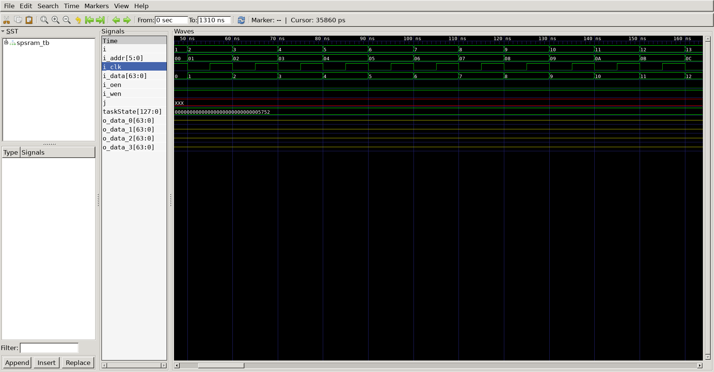
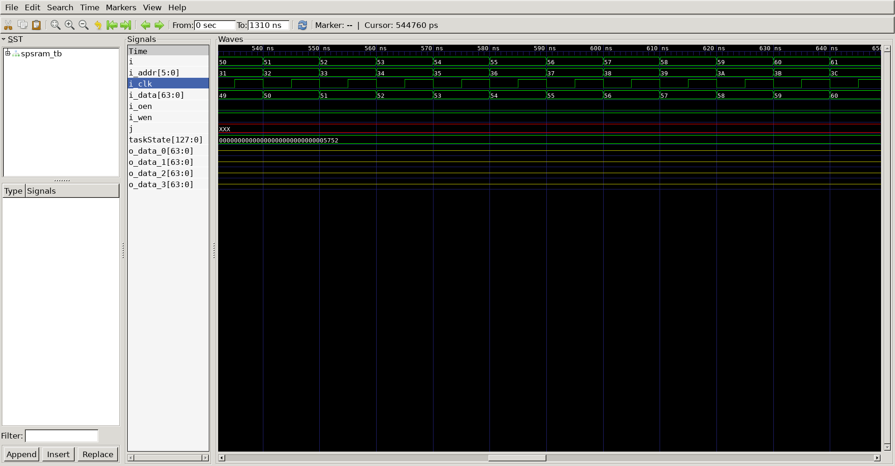
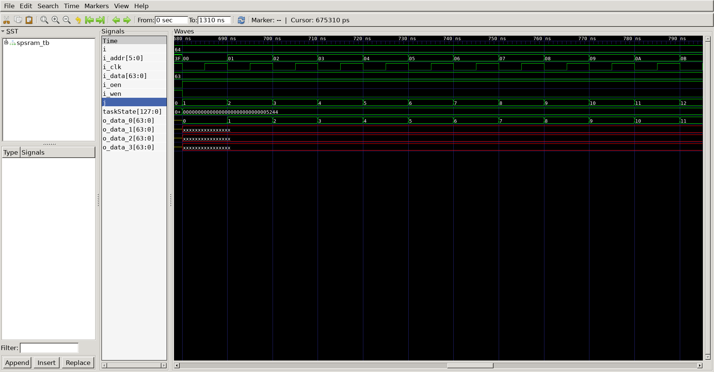
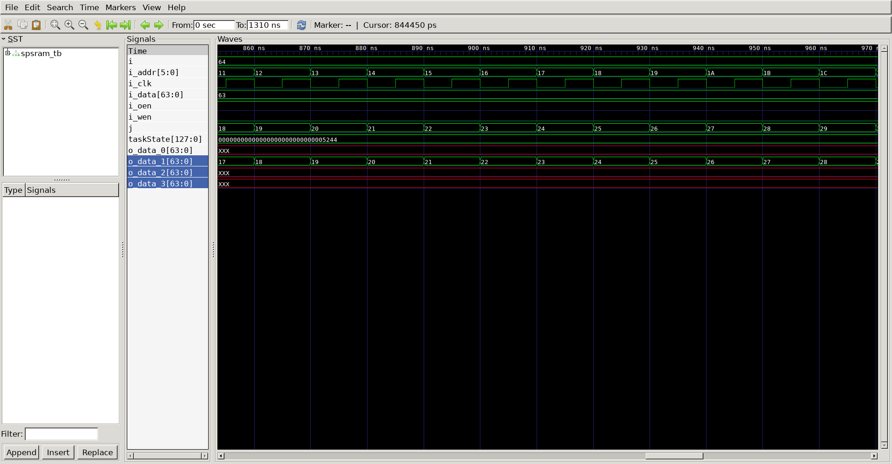
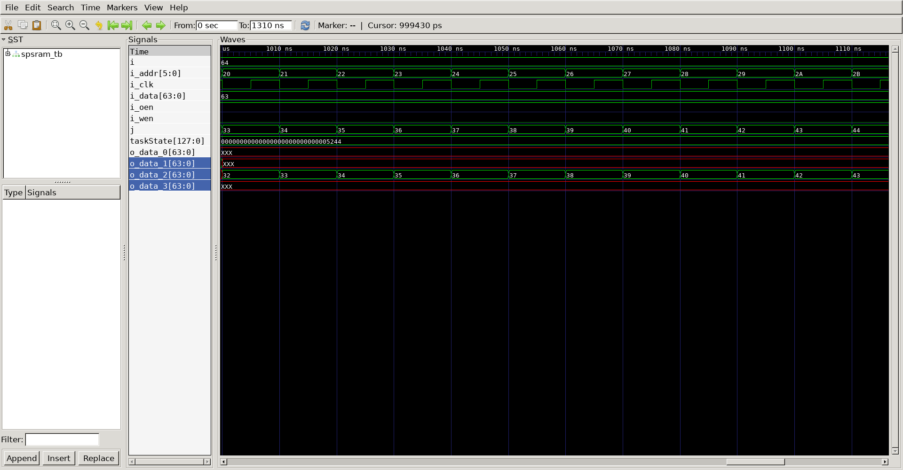
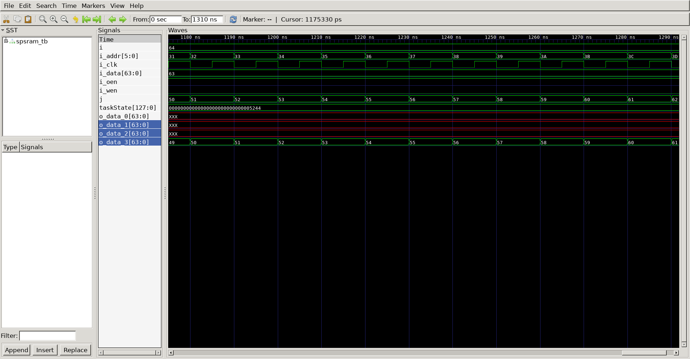

# Sram Extension
## Operation Principle
- 4-bit Addr. % 32-bit I/O Data 
=> 6-bit Addr. & 64-bit I/O Data

## Verilog Code
### DUT
```verilog 
module spsram
#(
	parameter	BW_DATA = 32,
	parameter	BW_ADDR = 5
)
(
	output		[BW_DATA-1:0]	o_data,
	input		[BW_DATA-1:0]	i_data,
	input		[BW_ADDR-1:0]	i_addr,
	input						i_wen,
	input						i_cen,
	input						i_oen,
	input						i_clk
);

//Memoery Write
reg		[BW_DATA-1:0]	mem[0:2**BW_ADDR-1];
always @(posedge i_clk) begin
	if(i_cen && i_wen) begin
		mem[i_addr] <= i_data;
	end else begin
		mem[i_addr] <=mem[i_addr];
	end
end

//	Memory Read
`ifdef	SPSRAM_ASYNC
	assign	o_data =	!i_oen			? 'bz :
						i_cen && !i_wen ? mem[i_addr] : 'bx;

`else
	reg		[BW_DATA-1:0]	o_data;
	always @(posedge i_clk) begin
		if(i_oen) begin
			if(i_cen && !i_wen) begin
				o_data	<= mem[i_addr];
			end else begin
				o_data	<= 'bx;
			end
		end else begin
			o_data	<= 'bz;
		end
	end
`endif
endmodule
```

### Testbench
```verilog 
`define CLKFREQ		100
`define	SIMCYCLE	64
`define BW_DATA		64
`define	BW_ADDR		6

`define	SPSRAM_ASYNC
//-------------------------------
// Includes
//-------------------------------
`include	"spsram.v"

module	spsram_tb;

// -------------------------------
// DUT Signals & Instantiate
// -------------------------------
	wire	[`BW_DATA-1:0]	o_data_0;
	wire	[`BW_DATA-1:0]	o_data_1;
	wire	[`BW_DATA-1:0]	o_data_2;
	wire	[`BW_DATA-1:0]	o_data_3;
	reg		[`BW_DATA-1:0]	i_data;
	reg		[`BW_ADDR-1:0]	i_addr;
	reg						i_wen;
	reg						i_oen;
	reg						i_clk;

	spsram
	#(
		.BW_DATA		(`BW_DATA		),
		.BW_ADDR		(`BW_ADDR		)
	)
	u_spsram_0(
		.o_data			(	o_data_0	),
        .i_data			(	i_data		),
        .i_addr			(	i_addr		),
        .i_wen			(	i_wen		),
        .i_cen			(	i_addr[`BW_ADDR-1 : 4] == 0),
        .i_oen			(	i_oen		),
        .i_clk			(	i_clk		)
	);

	spsram
	#(
		.BW_DATA		(`BW_DATA		),
		.BW_ADDR		(`BW_ADDR		)
	)
	u_spsram_1(
		.o_data			(	o_data_1	),
        .i_data			(	i_data		),
        .i_addr			(	i_addr		),
        .i_wen			(	i_wen		),
        .i_cen			(	i_addr[`BW_ADDR-1 : 4] == 1),
        .i_oen			(	i_oen		),
        .i_clk			(	i_clk		)
	);
	
	spsram
	#(
		.BW_DATA		(`BW_DATA		),
		.BW_ADDR		(`BW_ADDR		)
	)
	u_spsram_2(
		.o_data			(	o_data_2	),
        .i_data			(	i_data		),
        .i_addr			(	i_addr		),
        .i_wen			(	i_wen		),
        .i_cen			(	i_addr[5] & ~i_addr[4]	),
        .i_oen			(	i_oen		),
        .i_clk			(	i_clk		)
	);

	spsram
	#(
		.BW_DATA		(`BW_DATA		),
		.BW_ADDR		(`BW_ADDR		)
	)
	u_spsram_3(
		.o_data			(	o_data_3	),
        .i_data			(	i_data		),
        .i_addr			(	i_addr		),
        .i_wen			(	i_wen		),
        .i_cen			(	i_addr[5] & i_addr[4]),
        .i_oen			(	i_oen		),
        .i_clk			(	i_clk		)
	);

// -------------------------------
// Clock 
// -------------------------------
	always #(500/`CLKFREQ)		i_clk = ~i_clk;

// -------------------------------
// Tasks
// -------------------------------
	reg		[4*32-1:0] taskState;

task	init;
	begin
        i_data	= 0;	
        i_addr	= 0;	
        i_wen 	= 0;  
        i_oen 	= 0;  
        i_clk 	= 0;  
	end
endtask

task memWR;
	input	[`BW_ADDR-1:0] ti_addr;
	input	[`BW_DATA-1:0] ti_data;
	begin
		@(negedge i_clk) begin
			taskState	= "WR";
            i_data	= ti_data;	
            i_addr	= ti_addr;
            i_wen	= 1;	
            i_oen	= 0;
		end
	end
endtask

task memRD;
	input	[`BW_ADDR-1:0]	ti_addr;
	begin
		@(negedge i_clk) begin
			taskState = "RD";
			i_addr	= ti_addr;
			i_wen	= 0; 
			i_oen	= 1;
		end
	end
endtask

// -------------------------------
// Test Stimulus
// -------------------------------
	integer		i, j;
	initial begin
		init();
		#(4*1000/`CLKFREQ);

		for (i=0; i<`SIMCYCLE; i++) begin
			memWR(i,i);
		end
		for (j=0; j<`SIMCYCLE; j++) begin
			memRD(j);
		end
		$finish;
	end

// -------------------------------
// Dump VCD
// -------------------------------
	reg [8*32-1:0] vcd_file;
	initial begin
		if ($value$plusargs("vcd_file=%s", vcd_file)) begin
			$dumpfile(vcd_file);
			$dumpvars;
		end else begin
			$dumpfile("spsram_tb.vcd");
			$dumpvars;
		end
	end

endmodule
```

##	Simulation Result
-write0

-write1

-write2

-write3

-read0

-read1

-read2

-read3


